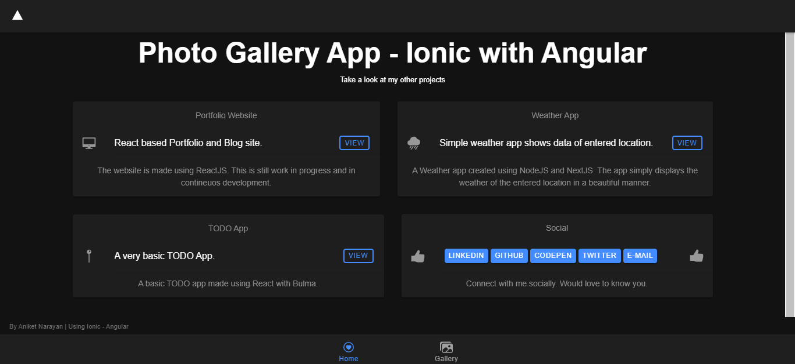

Yesterday, I was trying to learn [Ionic framework](https://ionicframework.com/), and found out that Hybrid App development is **easy** *(easy, not better)* in this platform compared to [React Native](https://reactnative.dev/). (If interested *a very good comaparison is available [here](https://codeburst.io/react-native-vs-ionic-explained-a-step-by-step-evaluation-23975999887)*).



I started to create the [first app](https://ionicframework.com/docs/angular/your-first-app/) presented as an example. Once build, I thoght of publishing the app over GitHub Page. As the application was build using Ionic Framework with Angular, it cannot be pushed directly to be hosted at GitHub as GitHub pages only support static sites and understand only ```HTML```,```CSS``` and ```JavaScript```.


#### Here is the way I followed to publish the Ionic app as GitHub Pages. 

1. Install the ***angular-cli-ghpages*** plugin (as I was developing the Angular based app.)
as - 
```bash
$ npm i angular-cli-ghpages --save
```

> If you're using the Ionic Framework with ***React***, please run below command

```bash
$ npm i gh-pages --save
```

2. Connect with the Repository created at your GitHub account for this project and verify it

```bash
$ git remote add origin https://github.com/user/repo.git
# Set a new remote

$ git remote -v
# Verify new remote
> origin  https://github.com/user/repo.git (fetch)
> origin  https://github.com/user/repo.git (push)
```

3. Once connected, push all the code to the master branch 
```bash
$ git add -u
# Add all the files for commit

$ git commit -m "Initail Commit Message"
# Commiting all the added files

$ git push origin master
# Push code to the master branch of remote repo
```

> If you want to remove a file that was added for commit but you don't want it to be commited, you can run (before running the ```commit``` command)
```bash
$ git reset -- filename
```

4. Now as the files are commited over master branch, let's build a production build using following command
```bash
$ ionic build --prod -- --base-href https://github_username.github.io/repo_name_you_have_created_before/
```
What does this command do that it will create the ```www``` folder in the project, which is almost comparable to the ```dist``` folder for Angular applications. ```--base-href``` will sets your GitHub page domain as base href in the ```index.html``` file.

> Now if you see your ```www``` folder, it will consists of only ```JavaScript```, ```HTML``` and ```CSS``` files that are needed for GitHub pages but still this require an additional step.

5. Now this ```www``` needed to be optimised for GitHub Pages, which will be taken care by the plugin ```gh-pages```.
Run the following command
```bash
$ npx angular-cli-ghpages --dir=www
```

The flag at the end of the command points to the ```www``` folder, where the ```index.html``` file is located that will be displayed at ```https://github_username.github.io/
repo_name_you_have_created_before/```. 
The plugin will create a branch called **gh-pages** in your remote project that contains all files which are located in your ```www``` folder.

6. At last, head over to GitHub and select the **gh-page** branch in the settings of your project (*https://github.com/github_username
/repo_name_you_have_created_before/settings*) as a source for your GitHub page.

> Note: ```gh-page``` branch or ```master``` branch can only be selected.

That's it. Give some time and you can see your app running at ```https://github_username.github.io
/repo_name_you_have_created_before/```.

You can see my app [here](https://mrgooglr.github.io/photo-gallery-angular/).
