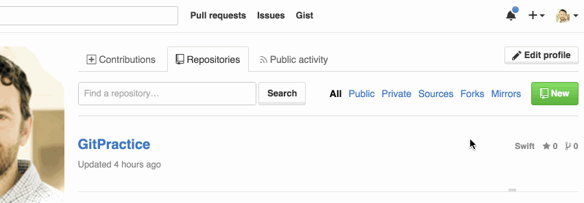

No matter whether you're a student learning new technologies and building a project or a professional working in a multinational company with hundrads of developers in a team project, Git is something you will encounter in your developer life sooner or later.

It's better to learn Git early as this is a way to go for project management if you're getting hired in any software company.

Here I've summed up some basic info about Git along with some very basic commands that everyone will encounter and are most used.


### What is Git?

Git is a free and open source **distributed version control system (dVCS)** designed to handle everything from small to very large projects with speed and efficiency.

Git is easy to learn and has a tiny footprint with lightning fast performance. It outclasses SCM *(Software configuration management)* tools like Subversion, CVS, Perforce, and ClearCase with features like cheap local branching, convenient staging areas, and multiple workflows.


Now as we know, Git is nothing but a software written to handle the task of tracking and controlling changes in the software codebase.

The first thing to do is to download Git from [official site](https://git-scm.com/).
Once downloded, [install](https://github.com/git-guides/install-git) the Git software on your system and you're good to go.


#### Installed Git. Now what?

Nice. Now, as git is installed, we can initalize the git to make revisions of our codebase. As git is installed locally, the versioning can only be done locally. So what we are going to do next is creating a remote area where we can push (upload) our code.

For this, just headover to [GitHub](https://github.com/) and sign-up for a free account if not already. 

> Many people confuse Git with GitHub, you shouldn't. Why? because Git is a revision control system, a tool to manage your source code history while GitHub is a hosting service for Git repositories. Git is the tool, GitHub is the service for projects that use Git. There are other hosting services too for Git like [GitLab](https://gitlab.com/), [BitBucket](https://bitbucket.org) and many others.

After creating your account on GitHub, first [create a Repository](https://docs.github.com/en/github/getting-started-with-github/create-a-repo) (Repository is nothing but a folder at GitHub), where the code will be uploded for version controlling.



**Dont't initialize the repo with README.md if you're going to do what I have wriiten after this.**

> On Windows, we have to use GitBash (Installed already with git-scm) for git commands, Linux and MacOS users can simply use the terminal for this.

#### Working on Git

I'm assuming you've a Windows machine for the rest of the post.

> Please change the paths and name of folders accordingly when using on your system.
Don’t type the $; or #; that just indicates that you’re doing this at the command line.


+ Navigate to the directory which you want to be versioned and controlled by git.

```bash
$ cd "H:\test-folder\basic-directory"
```

Assuming the *basic-directory* inside *H:* drives' *test-folder* is the location where your code is available.


+ Now initialise an empty git repository inside this folder as 

```bash
$ git init
```

What it will do is create a ***.git*** folder inside *basic-directory* location. This folder the contains all the information for git to work. This repository is called ***master branch*** by default.


+ Before we can connect our local repository with the one we have created on GitHub, we need to run these commands:

```bash
$ git config --global user.name "Your name here"
$ git config --global user.email "your_email@example.com"
```


+ Now we need to connect this local repository to the remote repository that we have created on GitHub. Type

```bash
$ git remote add origin https://github.com/MrGooglr/todo-app
# This will add to remote repo 
```

> If asked for GitHub password, type the password and cache it so that you don't have to type it everytime you work on git.


+ The best thing about git is it first make local commits and those local commits are then pushed to the remote repository. 

The steps that I do is:

```bash
# Check the status of files in local repo
$ git status

# Adding all the files available at the local repo for local commit
$ git add .

#Commiting those added files locally using
$ git commit -m "A useful commit msg here"
```

What we have done till now is checked the status of files and added all the files for versioning followed by a local commit to the local git repository.
We then need to push the local changes to the remote repository.

> ```commit``` is for local git upload while ```push``` is for remote upload.
Also, what you type in commit message at ***-m "commit msg"*** is going to be same at the time of remote push. 


+ Remote push local changes by typing:

```bash
$ git push -u origin master
```

***-u*** is for upstream and you can skip this flag if not want to use here.

#### Pushed to the remote repository. Now what?

Now how to take pull when some other person done changes to the remote repository?

For this lets head over to the GitHub repository in which we have pushed our code and add a README.md file there.

Once added get back to terminal and type:

```bash
$ git pull origin master
```  

This will tell you that README.md file is added to the local repository and now you can do changes on it.

Add some line on README.md using text editor of your choice say "First Commit after taking pull."

Do the same steps from ```$ git status``` till ```git push origin master``` and your changes are pushed to the remote repository for others to see and work upon.


#### Some other usefull commands while working on Git.

+ Exclude a file after adding all the files for commit.
```bash
$ git reset -- filename
```

+ Show branch in which I'm working
```bash
$ git branch
# Display all the brances available with a * for current branch
```

+ Create a new branch
```bash
$ git branch my-branch-feature-name
```

+ Switching between branches
```bash
$ git checkout branch-name
```

+ Merging another branch with master branch
```bash
$ git checkout master

$ git merge branch-name-to-mearge

## Manually remove the conflicts if any
```
> Please [read here](https://stackoverflow.com/questions/5601931/what-is-the-best-and-safest-way-to-merge-a-git-branch-into-master) for more info.

+ Create a stash of local changes to work on something and poping those changes later
```bash
$ git stash

# Do your work on new code and push it.

$ git stash pop

# get your work back from where you left.
```


You can always get better understanding of the git commands by following official docs [here](https://git-scm.com/docs). What I've intended to do is tell you some very basics of git and how you can use it for your project management. 

Hope this article was meaningful to you.

