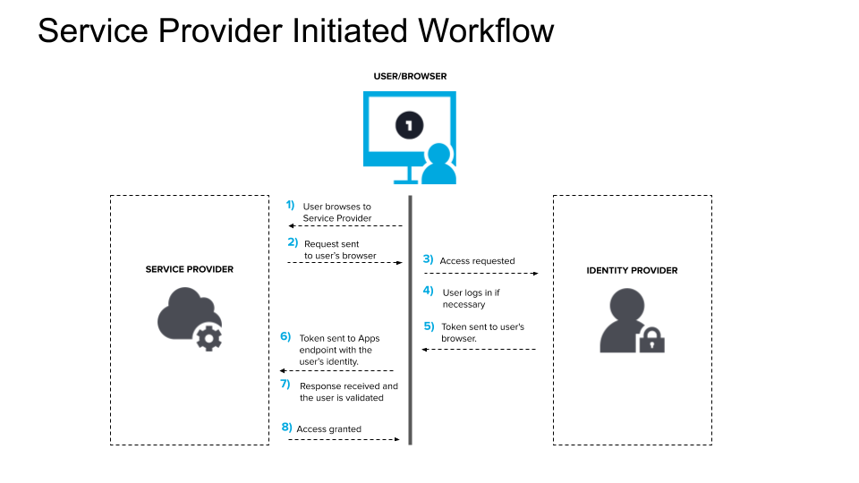

#### What is Single Sign-On?

Single sign-on (SSO) is an authentication method that enables users to securely authenticate with multiple applications and websites by using just one set of credentials.

#### How Does SSO Work?

SSO works based upon a trust relationship set up between an application, known as the service provider, and an identity provider. This trust relationship is often based upon a certificate that is exchanged between the identity provider and the service provider. This certificate can be used to sign identity information that is being sent from the identity provider to the service provider so that the service provider knows it is coming from a trusted source. In SSO, this identity data takes the form of tokens which contain identifying bits of information about the user like a user’s email address or a username.

The login flow usually looks like this:

- A user browses to the application or website they want access to, aka, the Service Provider.
- The Service Provider sends a token that contains some information about the user, like their email address, to the SSO system, aka, the Identity Provider, as part of a request to authenticate the user.
- The Identity Provider first checks to see whether the user has already been authenticated, in which case it will grant the user access to the Service Provider application and skip to step 5.
- If the user hasn’t logged in, they will be prompted to do so by providing the credentials required by the Identity Provider. This could simply be a username and password or it might include some other form of authentication like a One-Time Password (OTP).
- Once the Identity Provider validates the credentials provided, it will send a token back to the Service Provider confirming a successful authentication.
- This token is passed through the user’s browser to the Service Provider.
- The token that is received by the Service Provider is validated according to the trust relationship that was set up between the Service Provider and the Identity Provider during the initial configuration.
- The user is granted access to the Service Provider.

When the user tries to access a different website, the new website would have to have a similar trust relationship configured with the SSO solution and the authentication flow would follow the same steps.

#### What is an SSO Token?

An SSO token is a collection of data or information that is passed from one system to another during the SSO process. The data can simply be a user’s email address and information about which system is sending the token. Tokens must be digitally signed for the token receiver to verify that the token is coming from a trusted source. The certificate that is used for this digital signature is exchanged during the initial configuration process.

#### Is SSO Secure?

The answer to this question is “It depends.”

There are many reasons why SSO can improve security. A single sign-on solution can simplify username and password management for both users and administrators. Users no longer have to keep track of different sets of credentials and can simply remember a single more complex password. SSO often enables users to just get access to their applications much faster.

SSO can also cut down on the amount of time the help desk has to spend on assisting users with lost passwords. Administrators can centrally control requirements like password complexity and multi-factor authentication (MFA). Administrators can also more quickly relinquish login privileges across the board when a user leaves the organization.

Single Sign-On does have some drawbacks. For example, you might have applications that you want to have locked down a bit more. For this reason, it would be important to choose an SSO solution that gives you the ability to, say, require an additional authentication factor before a user logs into a particular application or that prevents users from accessing certain applications unless they are connected to a secure network.

#### Are There Different Types of SSO?
There are a lot of terms that are used when we talk about Single Sign-On (SSO).

- Federated Identity Management (FIM)
- OAuth (specifically OAuth 2.0 nowadays)
- OpenID Connect (OIDC)
- Security Access Markup Language (SAML)
- Same Sign On (SSO)

SSO is actually a part of a larger concept called Federated Identity Management, thus sometimes SSO is referred to as federated SSO. FIM just refers to a trust relationship that is created between two or more domains or identity management systems. Single Sign-on is often a feature that is available within a FIM architecture.

OAuth 2.0 is a specific framework that could also be considered part of a FIM architecture. OAuth focuses on that trusted relationship allowing user identity information to be shared across the domains.

OpenID Connect (OIDC) is an authentication layer that was built on top of OAuth 2.0 to provide Single Sign-on functionality.

Same Sign On which is also often referred to as SSO is actually not the same as Single Sign-on because it doesn’t involve any trust relationship between the entities that are doing the authentication. It is more dependent on credentials being duplicated between systems and simply passing in those credentials when necessary. It is not as secure as any of the Single Sign-on solutions.

There are also some specific systems that commonly come up when we are discussing Single Sign-on: Active Directory, Active Directory Federation Services (ADFS) and Lightweight Directory Access Protocol (LDAP).

Active Directory, which nowadays is specifically referred to as Active Directory Directory Services (ADDS), is Microsoft’s centralized directory service. Users and resources are added to the directory service for central management and ADDS works with authentication protocols like NTLM and Kerberos. Thus, users that belong to ADDS can authenticate from their machines and get access to others systems that integrate with ADDS. This is a form of Single Sign-on.

Active Directory Federation Services (ADFS) is a type of Federated Identity Management system that also provides Single Sign-on capabilities. It supports both SAML and OIDC. ADFS is primarily used to set up trust between ADDS and other systems such as Azure AD or other ADDS forests.

Lightweight Directory Access Protocol (LDAP) is simply an industry standard that defines a way to organize and query directory information. LDAP allows you to centrally manage resources like users and systems. LDAP, however, does not define how you log into those systems, meaning it does not define the actual protocols that are used in authentication. It is, however, often used as part of the authentication process and access control processes. For example, before a user can access a particular resource, LDAP might be used to query for that user and any groups that they belong to in order to see if the user has access to that resource. LDAP solutions like OpenLDAP do provide authentication through their support of authentication protocols like Simple Authentication and Security Layer (SASL)

#### What is App-to-App SSO?

Lastly, you might have heard of App-to-App or Application-to-Application SSO. This is not quite an industry standard yet. It is more of a term that has been used by SAPCloud to describe the process of passing a user identity from one application to another within their ecosystem. It is somewhat similar to OAuth 2.0 but again it is not a standard protocol or method and is currently specific to SAPCloud.
